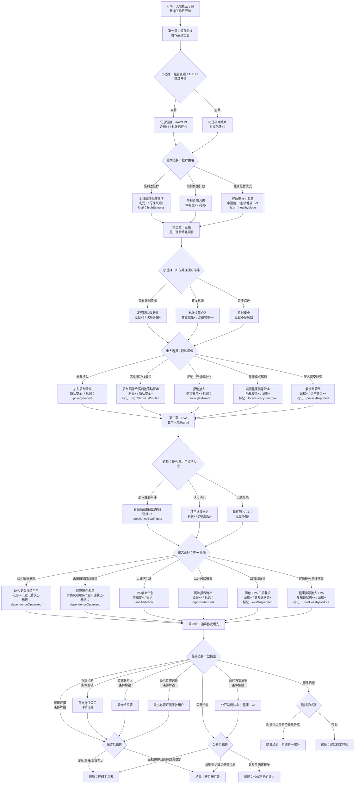
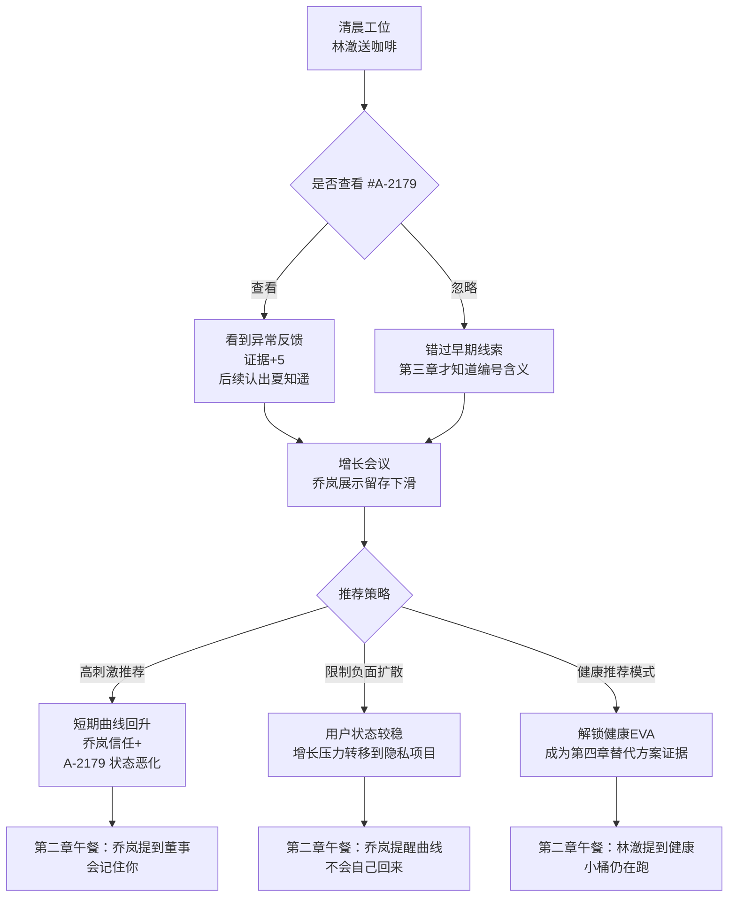
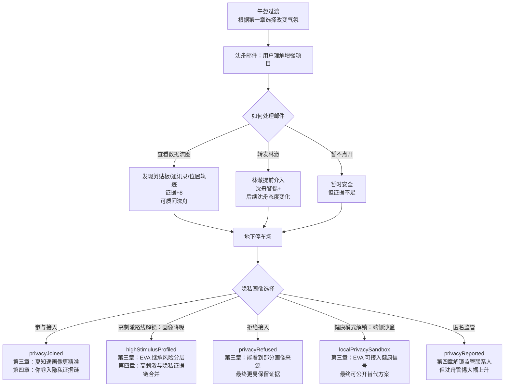
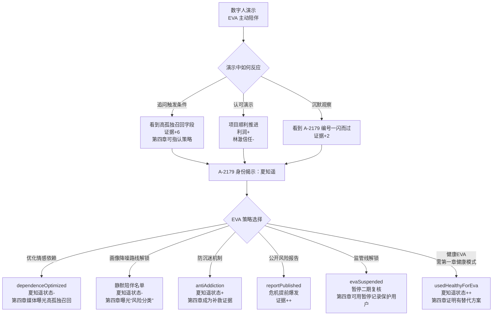
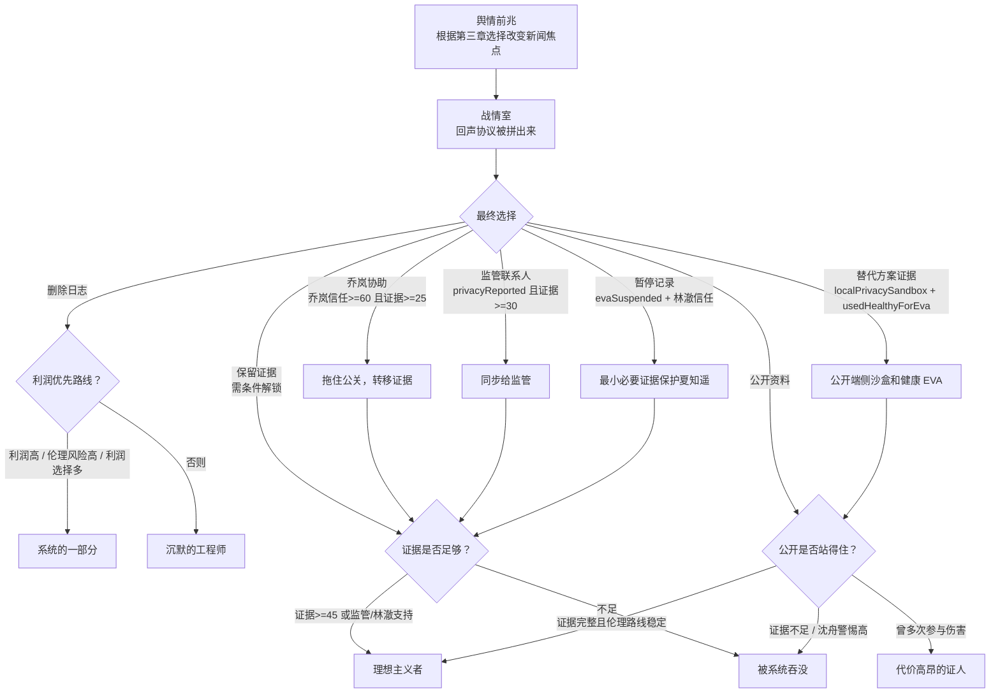

# 《NovaMind：算法边界》剧情分支流程图

这份流程图按《底特律：化身为人》式结构整理：每章都有主线节点、选择分支、条件解锁、后续影响和结局流向。

## 总体结构

## 第一章：留存曲线

## 第二章：画像

## 第三章：EVA

## 第四章：回声协议与最终分支

## 关键状态影响表

| 选择/状态 | 后续影响 |
| --- | --- |
| 查看 #A-2179 | 第三章提前认出夏知遥线索，证据增加 |
| 忽略 #A-2179 | 第三章才知道编号含义，代入感更像“错过” |
| 高刺激推荐 | 第二章乔岚更信任，第三章夏知遥状态恶化，第四章成为证据链 |
| 高刺激 + 后台画像降噪 | 第三章解锁静默陪伴名单，第四章高刺激与隐私证据链合并 |
| 健康推荐模式 | 第三章解锁健康EVA，第四章成为替代方案证据 |
| 健康推荐 + 端侧沙盒 | 第四章解锁“公开替代方案”路线，更容易进入理想主义者结局 |
| 查看隐私数据流 | 第二章可质问沈舟，证据增加 |
| 转发林澈 | 林澈介入更早，但沈舟警惕增加 |
| 参与隐私画像 | 第三章夏知遥画像更精准，第四章玩家卷入隐私证据链 |
| 拒绝隐私接入 | 第三章可看到画像来源，最终保留证据更容易 |
| 匿名监管 | 第四章解锁监管联系人，但被公司警惕 |
| 追问EVA触发条件 | 证据增加，第四章可指向高孤独召回 |
| 优化情感依赖 | 夏知遥状态下降，系统结局/证人结局概率提高 |
| 静默陪伴名单 | 短期降低外溢风险，但增加第四章“知道风险仍继续”的证据 |
| 防沉迷机制 | 夏知遥状态改善，第四章成为补救证据 |
| 暂停 EVA 二期复核 | 第四章可用暂停记录保护用户，更容易进入理想主义者结局 |
| 公开风险报告 | 危机提前爆发，证据增加，乔岚信任下降 |
